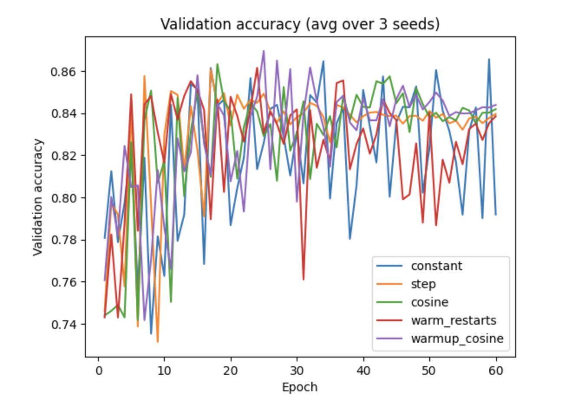

# Cancer Detection in Histopathology Images using ResNet-34

This project investigates how different learning rate scheduling strategies affect the training behaviour and performance of a ResNet-34 convolutional neural network on the PatchCamelyon (PCam) histopathology dataset.

The goal is to analyse how learning rate schedules influence optimization dynamics, convergence stability, and generalization performance in deep neural networks.

---

## Dataset

The PatchCamelyon (PCam) dataset is a benchmark dataset for cancer detection in histopathology images.

- Binary classification task: tumor vs non-tumor tissue
- Image patches extracted from whole-slide histopathology images
- Training, validation, and test splits provided by the dataset

Dataset source:
https://github.com/basveeling/pcam

---

## Model

A **ResNet-34 convolutional neural network** is used for classification.

Key characteristics:

- Deep residual architecture with skip connections
- Final fully connected layer adapted for binary classification
- Random weight initialization

---

## Training Configuration

Training settings used for all experiments:

- Optimizer: SGD
- Momentum: 0.9
- Weight decay: 5 × 10⁻⁴
- Batch size: 64
- Training epochs: 60

Data augmentation:

- Random horizontal flips
- Random rotations (±10°)

---

## Learning Rate Scheduling Experiment

Five learning rate scheduling strategies were evaluated:

- Constant learning rate
- Step decay
- Cosine annealing
- Cosine annealing with warm restarts
- Linear warmup followed by cosine decay

All models were trained using the same configuration and evaluated across **three random seeds (42, 43, 44)**.

---

## Results

The following plot shows the comparison of validation accuracy across different learning rate schedules.

The results indicate that learning rate scheduling significantly affects convergence behaviour and model generalization.

---

## Author

Keerthija Bontu  
M.Eng. Information Technology (Specialization: Artificial Intelligence)
