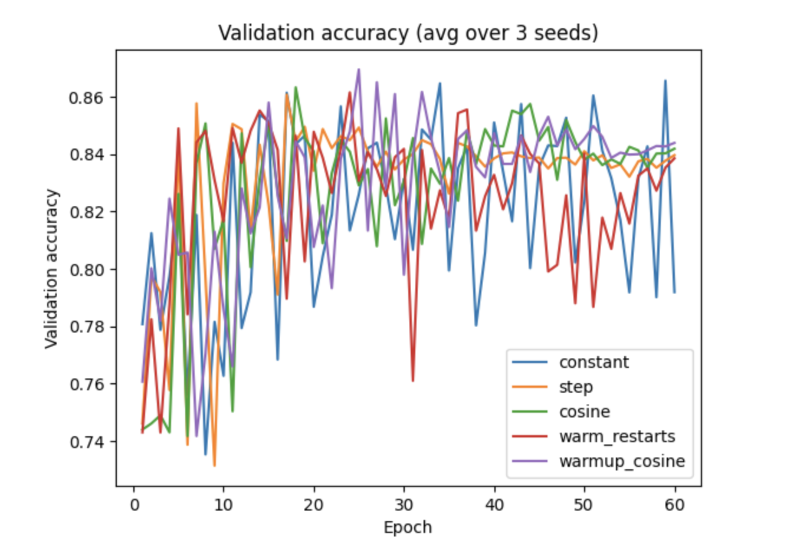
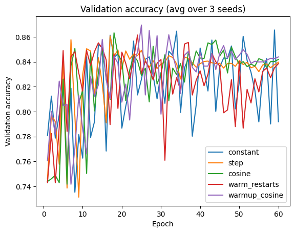
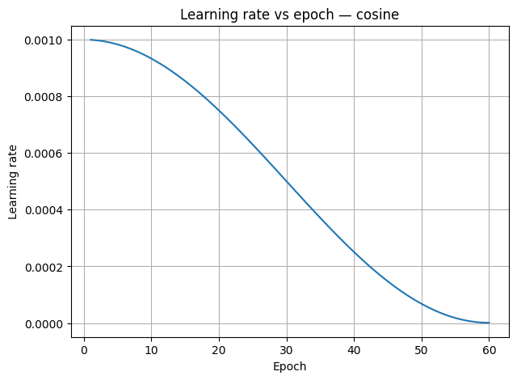
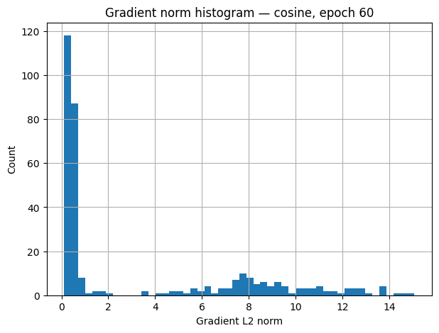

# Training Optimisation for Histopathology Image Classification using ResNet-34

This project is from my Deep Neural Networks coursework, where I worked on the PatchCamelyon (PCam) histopathology image classification task. The larger project was about cancer detection from medical image patches, and my individual part focused on something I found very important while training deep learning models: how the learning-rate schedule changes convergence, stability, and final generalisation.

Instead of only training one CNN and reporting accuracy, I compared multiple learning-rate scheduling strategies on a ResNet-34 model and analysed their behaviour using validation metrics, learning curves, learning-rate evolution, and gradient norm distributions.

## What I Worked On

- Trained and evaluated a ResNet-34 CNN for binary histopathology image classification
- Used the PatchCamelyon dataset for tumour vs non-tumour tissue classification
- Compared five learning-rate strategies across multiple random seeds
- Analysed validation accuracy, F1-score, ROC-AUC, learning curves, and gradient norms
- Studied how training schedules affect convergence speed, stability, and generalisation

## Why This Project Matters

In medical image classification, getting a high accuracy number is not enough. The model also needs to train reliably and generalise well. During this project, I wanted to understand why two training runs with the same architecture can behave differently, and how choices such as cosine annealing, warm restarts, or warmup can influence the training process.

This made the project more than a simple image classification task. It became an experiment on model training behaviour and deep learning optimisation.

## Dataset

The project uses the PatchCamelyon (PCam) dataset, a benchmark dataset for histopathology image classification.

- Task: binary classification
- Classes: tumour and non-tumour tissue patches
- Input: histopathology image patches
- Dataset type: medical computer vision

Dataset reference: [PatchCamelyon dataset](https://github.com/basveeling/pcam)

## Model And Training Setup

The model used for the experiments was ResNet-34.

Main training setup:

- Model: ResNet-34
- Framework: PyTorch
- Optimiser: SGD
- Momentum: 0.9
- Weight decay: 5e-4
- Batch size: 64
- Epochs: 60
- Random seeds: 42, 43, 44
- Data augmentation: random horizontal flips and random rotations

## Learning-Rate Schedules Compared

I compared five schedules:

- Constant learning rate
- Step decay
- Cosine annealing
- Cosine annealing with warm restarts
- Linear warmup followed by cosine decay

The goal was not only to see which schedule gave the best score, but also to understand how each schedule changed the training behaviour over time.

## Evaluation Metrics

The experiments were evaluated using:

- Validation accuracy
- Test accuracy
- F1-score
- ROC-AUC
- Training loss
- Validation loss
- Gradient norm distributions

Using more than one metric was important because medical image classification should not be judged only by accuracy.

## Results Summary

The table below shows the mean and standard deviation across three random seeds.

| Schedule | Validation Accuracy | Validation F1 | Validation ROC-AUC | Test Accuracy | Test F1 | Test ROC-AUC |
|---|---:|---:|---:|---:|---:|---:|
| Constant | 0.8138 +/- 0.0459 | 0.7772 +/- 0.0676 | 0.9051 +/- 0.0517 | 0.7753 +/- 0.0279 | 0.7188 +/- 0.0475 | 0.8895 +/- 0.0036 |
| Step decay | 0.8396 +/- 0.0077 | 0.8174 +/- 0.0105 | 0.9342 +/- 0.0046 | 0.7780 +/- 0.0025 | 0.7270 +/- 0.0046 | 0.8812 +/- 0.0049 |
| Cosine annealing | 0.8575 +/- 0.0080 | 0.8416 +/- 0.0108 | 0.9375 +/- 0.0019 | 0.7892 +/- 0.0071 | 0.7451 +/- 0.0108 | 0.8821 +/- 0.0122 |
| Warm restarts | 0.8385 +/- 0.0085 | 0.8152 +/- 0.0118 | 0.9329 +/- 0.0015 | 0.7763 +/- 0.0040 | 0.7227 +/- 0.0066 | 0.8837 +/- 0.0059 |
| Warmup + cosine | 0.8438 +/- 0.0031 | 0.8224 +/- 0.0044 | 0.9328 +/- 0.0037 | 0.7725 +/- 0.0023 | 0.7169 +/- 0.0034 | 0.8791 +/- 0.0067 |

Cosine annealing gave the strongest validation performance in this experiment, while warmup and restart-based schedules showed more controlled training behaviour in later epochs.

## Result Visualisations

### Validation Accuracy Comparison

### Averaged Validation Accuracy Curve

### Cosine Annealing Learning-Rate Evolution

### Gradient Norm Behaviour

## Key Findings

- Learning-rate scheduling had a clear impact on convergence and validation performance.
- Cosine annealing achieved the strongest validation accuracy and F1-score in the multi-seed comparison.
- Step decay and warmup-based schedules were more stable than a simple constant learning rate.
- Gradient norm analysis helped show how optimisation behaviour changed during training.
- Running multiple seeds made the comparison more reliable than judging from one training run.

## What I Learned

This project helped me understand that deep learning performance is not only about choosing a strong model architecture. Training decisions such as learning-rate scheduling, optimiser settings, random seeds, and evaluation metrics can strongly affect the final result.

It also gave me practical experience with medical image classification, CNN training pipelines, PyTorch experiments, reproducibility, and result analysis.

## Limitations

This was a university coursework project, and the original training environment is no longer available to me. Because of that, I am keeping this repository as a documented experiment with notebooks, results, and analysis rather than extending the model further.

If I continued this project, I would add:

- Confusion matrix analysis
- Grad-CAM explainability for model predictions
- More detailed error analysis on misclassified image patches
- External validation on a separate histopathology dataset
- A small inference script for testing new image patches

## Skills Demonstrated

Deep Learning, Computer Vision, Medical Image Classification, CNNs, ResNet-34, PyTorch, PatchCamelyon, Data Augmentation, Learning-Rate Scheduling, SGD, Cosine Annealing, Warm Restarts, Warmup, Multi-Seed Evaluation, F1-score, ROC-AUC, Learning Curves, Gradient Norm Analysis, Experiment Design, Model Evaluation.
